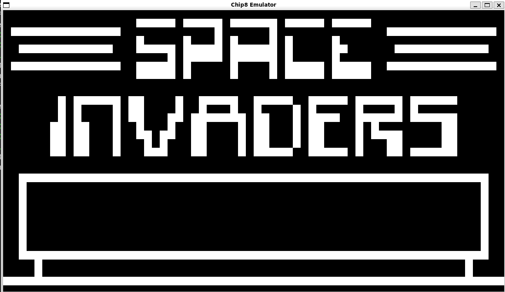

# Chip8_Emulator
Unix-targeted [chip8 emulator](https://en.wikipedia.org/wiki/CHIP-8) written in C with SDL

### Standard Chip-8 Instructions

| Opcode  | Mnemonic        | Description |
|---------|----------------|-------------|
| 00E0    | CLS            | Clear the display. |
| 00EE    | RET            | Return from a subroutine. |
| 0nnn    | SYS addr       | Jump to a machine code routine at `addr`. |
| 1nnn    | JP addr        | Jump to location `addr`. |
| 2nnn    | CALL addr      | Call subroutine at `addr`. |
| 3xkk    | SE Vx, byte    | Skip next instruction if `Vx == kk`. |
| 4xkk    | SNE Vx, byte   | Skip next instruction if `Vx != kk`. |
| 5xy0    | SE Vx, Vy      | Skip next instruction if `Vx == Vy`. |
| 6xkk    | LD Vx, byte    | Set `Vx = kk`. |
| 7xkk    | ADD Vx, byte   | Set `Vx = Vx + kk`. |
| 8xy0    | LD Vx, Vy      | Set `Vx = Vy`. |
| 8xy1    | OR Vx, Vy      | Set `Vx = Vx OR Vy`. |
| 8xy2    | AND Vx, Vy     | Set `Vx = Vx AND Vy`. |
| 8xy3    | XOR Vx, Vy     | Set `Vx = Vx XOR Vy`. |
| 8xy4    | ADD Vx, Vy     | Set `Vx = Vx + Vy`, set `VF = carry`. |
| 8xy5    | SUB Vx, Vy     | Set `Vx = Vx - Vy`, set `VF = NOT borrow`. |
| 8xy6    | SHR Vx {, Vy}  | Set `Vx = Vx SHR 1`, set `VF = least significant bit of Vx`. |
| 8xy7    | SUBN Vx, Vy    | Set `Vx = Vy - Vx`, set `VF = NOT borrow`. |
| 8xyE    | SHL Vx {, Vy}  | Set `Vx = Vx SHL 1`, set `VF = most significant bit of Vx`. |
| 9xy0    | SNE Vx, Vy     | Skip next instruction if `Vx != Vy`. |
| Annn    | LD I, addr     | Set `I = addr`. |
| Bnnn    | JP V0, addr    | Jump to location `addr + V0`. |
| Cxkk    | RND Vx, byte   | Set `Vx = random byte AND kk`. |
| Dxyn    | DRW Vx, Vy, n  | Display `n`-byte sprite starting at memory location `I` at `(Vx, Vy)`, set `VF = collision`. |
| Ex9E    | SKP Vx         | Skip next instruction if key with the value of `Vx` is pressed. |
| ExA1    | SKNP Vx        | Skip next instruction if key with the value of `Vx` is not pressed. |
| Fx07    | LD Vx, DT      | Set `Vx = delay timer value`. |
| Fx0A    | LD Vx, K       | Wait for a key press, store the value of the key in `Vx`. |
| Fx15    | LD DT, Vx      | Set `delay timer = Vx`. |
| Fx18    | LD ST, Vx      | Set `sound timer = Vx`. |
| Fx1E    | ADD I, Vx      | Set `I = I + Vx`. |
| Fx29    | LD F, Vx       | Set `I = location of sprite for digit Vx`. |
| Fx33    | LD B, Vx       | Store BCD representation of `Vx` in memory locations `I`, `I+1`, and `I+2`. |
| Fx55    | LD [I], Vx     | Store registers `V0` through `Vx` in memory starting at location `I`. |
| Fx65    | LD Vx, [I]     | Read registers `V0` through `Vx` from memory starting at location `I`. |

## Input

By default the mapping from keyboard to numpad is:
```
Keyboard    Numpad
1 2 3 4     1 2 3 C
Q W E R     4 5 6 D
A S D F     7 8 9 E
Z X C V     A 0 B F
```
## Requirements:

To build the project you could use the [FindSDL2 cmake setup](https://github.com/brendan-w/collector/blob/master/cmake/FindSDL2.cmake)
Or manually specify the SDL2 location through a Makefile

Built on Debian using cmake


### Support for custom colorscheme 


